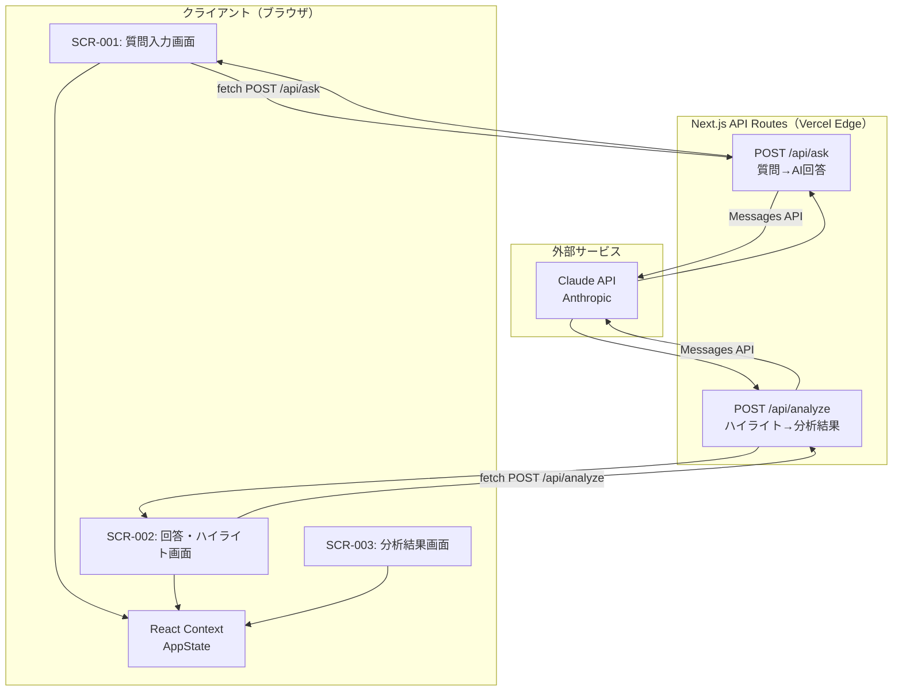

# 詳細設計書

## 1. 技術スタック

| レイヤー | 技術 | バージョン | 選定理由 | 代替案 |
|----------|------|-----------|----------|--------|
| フロントエンド | Next.js (App Router) | 15.x | React + SSR/CSR 統合。Vercel との親和性が高くデプロイが容易。API Routes でバックエンドも同梱できミニマル構成に適する | Vite + React SPA（API Routes 不要なら軽量だが、サーバーサイドでのAPIキー管理が困難） |
| 言語 | TypeScript | 5.x | データモデル設計書で型定義済みのスキーマをそのまま活用。実行時エラーをコンパイル時に検出 | JavaScript（型安全性なし） |
| スタイリング | Tailwind CSS | 3.x | ユーティリティファーストでモバイルファースト設計と相性が良い。設定不要ですぐ使える | CSS Modules（クラス命名コスト増）、Styled Components（ランタイムコスト） |
| UIコンポーネント | shadcn/ui | latest | Radix UI ベースでアクセシビリティ対応済み。コードをプロジェクトに直接コピーするため依存ロックなし | MUI（重量級）、Chakra UI（セットアップコスト） |
| 状態管理 | React Context + useReducer | - | 3画面 + セッション内完結のシンプルなフローに十分。外部ライブラリ不要 | Zustand（シンプルだが追加依存）、Redux（オーバースペック） |
| AI API | Claude API (claude-haiku-4-5) | - | 要件で Anthropic API 指定。haiku は低コストで応答速度が速く MVP に適する | claude-sonnet（高精度だがコスト高）、OpenAI GPT-4o-mini |
| インフラ | Vercel | - | Next.js の開発元で統合が最良。Hobby プランは無料。Edge Functions, CDN 自動適用 | Netlify（Next.js 対応はあるが Edge Functions の互換性に注意）、Railway |
| CI/CD | GitHub Actions + Vercel自動デプロイ | - | Vercel は GitHub 連携で push ごとに Preview URL を自動生成。追加設定ほぼ不要 | CircleCI（設定コスト高）、手動デプロイ |
| モニタリング | Vercel Analytics（無料枠）| - | Core Web Vitals を無設定で収集。MVP 段階ではこれで十分 | Sentry（エラー追跡が必要になれば追加）|

---

## 2. アーキテクチャ構成



### アーキテクチャ判断

| 判断事項 | 選択 | 理由 | トレードオフ |
|----------|------|------|-------------|
| レンダリング方式 | CSR（Client-Side Rendering） | 3画面すべてユーザー操作ドリブンで SEO 不要。状態は画面間で共有が必要なため CSR が自然 | SSR にしてもメリットがない。初回ロードが若干遅くなるが影響軽微 |
| API 方式 | REST（Next.js API Routes） | 2エンドポイントのみ。GraphQL の複雑さは不要 | GraphQL は将来の履歴機能追加時に有用だが MVP にはオーバースペック |
| バックエンド構成 | Next.js API Routes（モノレポ） | フロントとバックを同一リポジトリ・同一デプロイで管理。APIキーをサーバーサイドに隔離できる | 分離したい場合は Express/Hono に移行が必要だが MVP では不要 |
| 状態管理 | React Context + useReducer | グローバルステートは `AppState` 1つのみ。Context で十分 | 状態が増えた場合は Zustand へ移行を検討 |
| AIモデル | claude-haiku-4-5 | 低レイテンシ（〜1秒）・低コスト。要件の5秒以内・3秒以内を満たせる | claude-sonnet は分析精度が高いが応答速度・コストが増大 |
| Streaming | 非ストリーミング（一括レスポンス） | MVP ではシンプルさ優先。ハイライト機能は回答全文が必要なため一括の方が整合性が高い | Streaming はリアルタイム体験を改善するが実装複雑度が増す |

---

## 3. ディレクトリ構成

```
it-learning-navigator/
├── src/
│   ├── app/                          # Next.js App Router
│   │   ├── page.tsx                  # SCR-001: 質問入力画面
│   │   ├── answer/
│   │   │   └── page.tsx              # SCR-002: 回答・ハイライト画面
│   │   ├── result/
│   │   │   └── page.tsx              # SCR-003: 分析結果・アドバイス画面
│   │   ├── api/
│   │   │   ├── ask/
│   │   │   │   └── route.ts          # POST /api/ask
│   │   │   └── analyze/
│   │   │       └── route.ts          # POST /api/analyze
│   │   ├── layout.tsx                # ルートレイアウト（AppStateProvider）
│   │   └── globals.css
│   ├── components/
│   │   ├── ui/                       # shadcn/ui コンポーネント（自動生成）
│   │   │   ├── button.tsx
│   │   │   ├── badge.tsx
│   │   │   └── progress.tsx
│   │   └── features/
│   │       ├── QuestionForm.tsx      # 質問入力フォーム（SCR-001）
│   │       ├── AnswerHighlight.tsx   # 回答表示 + テキスト選択ハイライト（SCR-002）
│   │       ├── HighlightTagList.tsx  # ハイライト済み単語タグ一覧（SCR-002）
│   │       ├── DomainScoreBar.tsx    # 領域別レベルバー（SCR-003）
│   │       └── AdviceList.tsx        # 学習アドバイスリスト（SCR-003）
│   ├── context/
│   │   └── AppStateContext.tsx       # グローバル状態管理（Context + useReducer）
│   ├── lib/
│   │   ├── claude.ts                 # Claude API クライアント
│   │   └── prompts.ts                # プロンプトテンプレート（ask / analyze）
│   ├── hooks/
│   │   └── useTextSelection.ts       # テキスト選択検出カスタムフック
│   ├── types/
│   │   └── index.ts                  # 全型定義（データモデル設計書の型定義をそのまま移植）
│   └── services/
│       └── api.ts                    # クライアント側 fetch ラッパー
├── tests/
│   ├── unit/
│   │   ├── prompts.test.ts
│   │   └── useTextSelection.test.ts
│   └── e2e/
│       └── flow.spec.ts              # Playwright: 質問→ハイライト→分析の一連フロー
├── docs/                             # 設計ドキュメント（本リポジトリ）
├── .env.local                        # ANTHROPIC_API_KEY（gitignore）
├── .env.example                      # 環境変数のテンプレート
├── next.config.ts
├── tailwind.config.ts
├── tsconfig.json
└── package.json
```

---

## 4. API仕様

### エンドポイント一覧

| メソッド | パス | 説明 | 認証 | 対応US |
|----------|------|------|------|--------|
| POST | /api/ask | 質問を送信してAI回答を取得 | 不要 | US-001 |
| POST | /api/analyze | ハイライト単語から理解レベルと学習アドバイスを生成 | 不要 | US-004, US-005, US-010, US-011 |

---

### POST /api/ask

**リクエスト:**
```json
{
  "question": "DNSとは何ですか？"
}
```

| フィールド | 型 | 必須 | バリデーション |
|-----------|-----|------|----------------|
| question | string | YES | 1文字以上500文字以下 |

**レスポンス（200）:**
```json
{
  "answer": "DNS（ドメインネームシステム）は、インターネット上のドメイン名をIPアドレスに変換する仕組みです。..."
}
```

**エラーレスポンス:**
```json
{
  "error": {
    "code": "VALIDATION_ERROR",
    "message": "質問は500文字以内で入力してください"
  }
}
```

**プロンプト設計（`lib/prompts.ts`）:**
```
あなたはIT初心者向けの技術教師です。
以下の質問に対して、IT業界に入ったばかりの方にもわかりやすく、
しかし技術的に正確な回答を日本語で返してください。
回答は300〜500文字程度にまとめてください。
専門用語を使う場合は、その単語が独立して選択しやすいよう、
自然な形で文章に配置してください。

質問: {question}
```

---

### POST /api/analyze

**リクエスト:**
```json
{
  "question": "DNSとは何ですか？",
  "answer": "DNS（ドメインネームシステム）は...",
  "highlighted_words": [
    { "word": "IPアドレス", "position_start": 28, "position_end": 37 },
    { "word": "ネームサーバー", "position_start": 65, "position_end": 72 }
  ]
}
```

| フィールド | 型 | 必須 | バリデーション |
|-----------|-----|------|----------------|
| question | string | YES | 1文字以上 |
| answer | string | YES | 1文字以上 |
| highlighted_words | array | YES | 空配列可。各要素に `word` (string) が必須 |

**レスポンス（200）:**
```json
{
  "level_label": "ITインフラ 入門段階",
  "domain_scores": [
    { "domain": "ネットワーク", "score": 2, "max_score": 5, "label": "初級" },
    { "domain": "セキュリティ", "score": 0, "max_score": 5, "label": "未入門" },
    { "domain": "開発・プログラミング", "score": 3, "max_score": 5, "label": "中級" }
  ],
  "highlighted_words": ["IPアドレス", "ネームサーバー"],
  "advice_items": [
    {
      "priority": "high",
      "topic": "IPアドレスとサブネットの基礎",
      "comment": "「ネットワーク入門」から始めよう"
    }
  ]
}
```

**エラーレスポンス:**
```json
{
  "error": {
    "code": "AI_ERROR",
    "message": "分析の生成に失敗しました。もう一度お試しください"
  }
}
```

**プロンプト設計（`lib/prompts.ts`）:**
```
あなたはIT学習アドバイザーです。
以下の情報から、ユーザーのIT理解レベルを分析し、学習アドバイスを生成してください。

# 質問
{question}

# AIの回答
{answer}

# ユーザーがわからなかった単語
{highlighted_words_list}
（※空の場合は「全て理解できていた」と判断してください）

# 出力形式（JSONのみ返してください）
{
  "level_label": "全体的な習熟度を一言で（例: ITインフラ 入門段階）",
  "domain_scores": [
    {
      "domain": "領域名（ネットワーク/セキュリティ/開発・プログラミング/クラウド/データベース から該当するもの）",
      "score": 0〜5の整数,
      "max_score": 5,
      "label": "未入門/初級/中級/上級/熟練 のいずれか"
    }
  ],
  "highlighted_words": ["単語1", "単語2"],
  "advice_items": [
    {
      "priority": "high/medium/low",
      "topic": "学習トピック名",
      "comment": "一言アドバイス（30文字以内）"
    }
  ]
}

制約:
- domain_scores は質問内容に関係する領域のみ含める（1〜3件）
- advice_items は 2〜4件
- highlighted_words が空の場合は advice_items の優先度を全て "low" にする
- 回答はJSONのみ。説明文は不要
```

---

## 5. 認証・認可設計

**MVPはセッション完結 = 認証・認可なし**

| 項目 | 設計 |
|------|------|
| 認証方式 | なし（US-030 は Won't スコープ） |
| APIキー管理 | `ANTHROPIC_API_KEY` は `.env.local` に保持。Next.js API Routes からのみアクセス（クライアントサイドには絶対に露出させない） |
| レートリミット | Vercel Hobby プランの制限（1リクエスト/秒）に依存。悪用防止のため将来的に Upstash Redis でレートリミット追加を検討 |
| CORS | Next.js デフォルト（同一オリジンのみ許可）。外部からの直接 API 呼び出しを防止 |

---

## 6. エラーハンドリング方針

### サーバーサイド（API Routes）

| エラー分類 | HTTPステータス | エラーコード | 発生条件 |
|-----------|---------------|-------------|---------|
| バリデーションエラー | 400 | VALIDATION_ERROR | 必須フィールド欠如、文字数超過 |
| AIエラー | 502 | AI_ERROR | Claude API タイムアウト、レートリミット |
| サーバーエラー | 500 | INTERNAL_ERROR | 予期せぬ例外 |

### クライアントサイド（UI）

| エラー発生箇所 | ユーザー向け表示 | リカバリ手段 |
|---------------|----------------|------------|
| /api/ask 失敗 | フォーム下部に赤字「回答の取得に失敗しました。もう一度お試しください」 | 再送信ボタン（入力内容は保持） |
| /api/analyze 失敗 | SCR-003 に「分析に失敗しました」+ リトライボタン | リトライボタンで再分析 |
| ネットワーク切断 | 「インターネット接続を確認してください」 | - |

### エラーハンドリングの実装方針

```typescript
// api.ts: 全 fetch をラップしてエラー正規化
async function callApi<T>(path: string, body: unknown): Promise<T> {
  const res = await fetch(path, {
    method: 'POST',
    headers: { 'Content-Type': 'application/json' },
    body: JSON.stringify(body),
  });
  if (!res.ok) {
    const err = await res.json().catch(() => ({ error: { code: 'UNKNOWN', message: 'エラーが発生しました' } }));
    throw new ApiError(err.error.code, err.error.message, res.status);
  }
  return res.json();
}
```

---

## 7. 環境構成

| 環境 | 用途 | URL | デプロイトリガー |
|------|------|-----|----------------|
| local | 開発 | http://localhost:3000 | `npm run dev` |
| preview | PR レビュー用 | `https://[branch].vercel.app` | GitHub PR 作成時 |
| production | 本番 | `https://it-learning-navigator.vercel.app`（予定）| `main` ブランチへのマージ |

### 環境変数一覧

| 変数名 | 必須 | 説明 |
|--------|------|------|
| `ANTHROPIC_API_KEY` | YES | Anthropic API キー。Vercel の Environment Variables に設定 |
| `NEXT_PUBLIC_APP_URL` | NO | 本番 URL（OGP 等に使用。任意） |

---

## 8. 実装上の重要判断・補足

### テキスト選択ハイライトの実装方針

SCR-002 の「テキスト選択→ハイライト追加」は Web 標準の `Selection API` を使用する。

```typescript
// useTextSelection.ts
const selection = window.getSelection();
if (selection && selection.toString().trim()) {
  const selectedText = selection.toString().trim();
  // ポップアップ表示 → ユーザー確定 → タグに追加
}
```

ハイライト済み単語の視覚表現は `<mark>` タグ + Tailwind でスタイリング。
複数ハイライトの重複は MVP では許容し、同一単語の重複追加は `word` の一致で弾く。

### Claude API のレスポンスパース

`/api/analyze` では Claude に JSON を返させるが、モデルが余分なテキストを付加するケースに備えて、レスポンスから JSON 部分のみを抽出するパーサーを実装する。

```typescript
function extractJson(text: string): unknown {
  const match = text.match(/\{[\s\S]*\}/);
  if (!match) throw new Error('JSON not found in response');
  return JSON.parse(match[0]);
}
```

### TBD の解決

要件レビューで指摘された未解決事項の詳細設計での決定:

| TBD | 決定内容 | 理由 |
|-----|---------|------|
| TBD-001（シングル/マルチターン） | **シングルターン** | MVP のスコープ。マルチターンはセッション管理の複雑度を増す |
| TBD-003（ハイライト方式） | **テキスト選択UI**（ドラッグ選択） | 画面設計書に「回答テキストをドラッグ選択」と明記済み |
| TBD-004（技術スタック） | **本ドキュメントで確定**（Next.js + Vercel + Claude API） | - |
| TBD-002（分析方式） | **AIに完全委任**（claude-haiku にプロンプトで指示） | 固有ロジックを持つより AIの柔軟性を活かす。精度の期待値はプロンプトで制御 |
