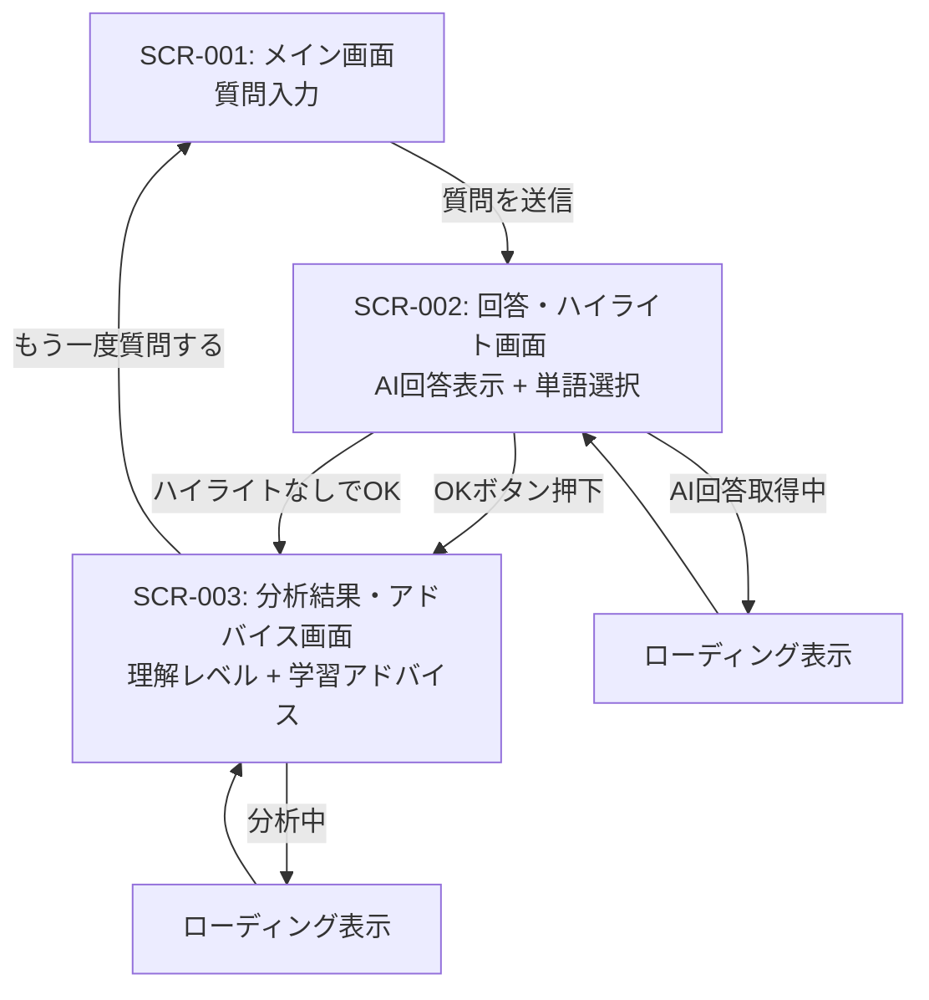

# 画面設計書

## 1. 画面一覧

| 画面ID | 画面名 | 概要 | 対応US |
|--------|--------|------|--------|
| SCR-001 | メイン画面（質問入力） | AIへの質問を入力する起点画面 | US-001 |
| SCR-002 | 回答・ハイライト画面 | AIの回答を表示し、わからない単語をハイライトする | US-002, US-003 |
| SCR-003 | 分析結果・アドバイス画面 | 理解レベル分析とハイライト単語一覧・学習アドバイスを表示 | US-004, US-005, US-010, US-011 |

---

## 2. 画面遷移図



---

## 3. 各画面の詳細

---

### SCR-001: メイン画面（質問入力）

**目的:** ユーザーがAIに技術的な質問を入力し、回答を取得する

**レイアウト（モバイル基準）:**
```
+----------------------------------+
| IT Learning Navigator            |
+----------------------------------+
|                                  |
|  ITの疑問を何でも聞いてみよう    |
|  ─────────────────────────────── |
|                                  |
|  [ 質問を入力してください...   ] |
|  [                             ] |
|  [                             ] |
|                                  |
|  例: 「DNSとは何ですか？」       |
|  例: 「HTTPSとHTTPの違いは？」   |
|                                  |
|       [  質問する  →  ]          |
|                                  |
+----------------------------------+
```

**UI要素:**

| 要素 | 種類 | 説明 | バリデーション |
|------|------|------|----------------|
| アプリタイトル | テキスト | 「IT Learning Navigator」 | - |
| キャッチコピー | テキスト | 「ITの疑問を何でも聞いてみよう」 | - |
| 質問入力フォーム | textarea | 複数行入力可。プレースホルダーあり | 空文字NG、最大500文字 |
| 入力例 | テキスト | ユーザーの入力を促すヒント | - |
| 質問するボタン | ボタン（primary） | 送信してAI回答画面へ | 入力空のときdisabled |

**インタラクション:**

- 質問するボタン押下 → AI呼び出し開始 → ローディング表示 → SCR-002へ遷移
- Enterキー（Shift+Enterで改行）でも送信可能
- AI呼び出し失敗時 → エラーメッセージをインライン表示（「回答の取得に失敗しました。もう一度お試しください」）

**状態一覧:**

| 状態 | UI表現 |
|------|--------|
| 初期表示 | 入力フォームが空、ボタンdisabled |
| 入力中 | ボタンactive |
| 送信中（ローディング） | ボタンをスピナーに置き換え、入力フォームdisabled |
| エラー | フォーム下部に赤字エラーメッセージ |

**対応ユーザーストーリー:** US-001

---

### SCR-002: 回答・ハイライト画面

**目的:** AIの回答を表示し、ユーザーがわからない単語をテキスト選択でハイライトして記録する

**レイアウト（モバイル基準）:**
```
+----------------------------------+
| ← 質問し直す                     |
+----------------------------------+
|                                  |
|  あなたの質問:                   |
|  「DNSとは何ですか？」           |
|                                  |
|  ─────────────────────────────── |
|  AIの回答                        |
|  ─────────────────────────────── |
|                                  |
|  DNS（ドメインネームシステム）は  |
|  インターネット上の[ドメイン名]を |
|  [IPアドレス]に変換する仕組みで  |
|  す。電話帳のように機能し、      |
|  [ネームサーバー]が問い合わせを  |
|  処理します。                    |
|  ※[  ]=ハイライト済み単語        |
|                                  |
|  ─────────────────────────────── |
|  わからなかった単語:             |
|  [IPアドレス ×] [ネームサーバー ×]|
|  ─────────────────────────────── |
|                                  |
|  [ ハイライトなし → スキップ ]   |
|  [      OK → 分析する      ]     |
|                                  |
+----------------------------------+
```

**UI要素:**

| 要素 | 種類 | 説明 | バリデーション |
|------|------|------|----------------|
| 戻るリンク | テキストリンク | 「← 質問し直す」でSCR-001へ | - |
| 質問テキスト | テキスト | 送信した質問の表示 | - |
| AI回答エリア | テキストエリア（読み取り専用） | AIの回答本文。テキスト選択可能 | - |
| ハイライト済み単語タグ | タグ（chip）| 選択した単語をタグ表示。×ボタンで削除可 | - |
| スキップボタン | ボタン（secondary） | ハイライトなしで分析に進む | - |
| OKボタン | ボタン（primary） | 分析・アドバイス生成を開始 | - |

**インタラクション:**

- 回答テキストをドラッグ選択 → ポップアップ「ハイライトする？」→ 確定でタグに追加
- タグの × ボタン → そのタグを削除、回答テキストのハイライトも解除
- OKボタン押下 → 分析API呼び出し → ローディング → SCR-003へ遷移
- スキップボタン押下 → 空のハイライトリストで分析API呼び出し → SCR-003へ遷移
- 「← 質問し直す」押下 → SCR-001へ戻る（回答・ハイライトはリセット）

**状態一覧:**

| 状態 | UI表現 |
|------|--------|
| 初期表示（AI回答表示直後） | タグなし、ハイライト指示テキストを表示 |
| テキスト選択中 | 選択範囲をハイライト色で強調 |
| ハイライト追加後 | タグに追加、回答テキストに着色 |
| 分析中（ローディング） | OKボタンをスピナーに置き換え |
| エラー | ボタン下部に赤字メッセージ |

**対応ユーザーストーリー:** US-002, US-003

---

### SCR-003: 分析結果・アドバイス画面

**目的:** ハイライト単語から推定した理解レベルと、具体的な学習アドバイスをユーザーに提示する

**レイアウト（モバイル基準）:**
```
+----------------------------------+
| あなたの理解レベル分析           |
+----------------------------------+
|                                  |
|  📊 現在の立ち位置               |
|  ─────────────────────────────── |
|  レベル: ITインフラ 入門段階     |
|                                  |
|  ネットワーク    ■■□□□ 初級     |
|  セキュリティ   □□□□□ 未入門   |
|  開発・プログラム ■■■□□ 中級   |
|                                  |
|  ─────────────────────────────── |
|  📝 わからなかった単語           |
|  ─────────────────────────────── |
|  • IPアドレス                    |
|  • ネームサーバー                |
|                                  |
|  ─────────────────────────────── |
|  🎯 次に学ぶべきこと             |
|  ─────────────────────────────── |
|  【優先度 高】                   |
|  IPアドレスとサブネットの基礎    |
|  → 「ネットワーク入門」から始めよう|
|                                  |
|  【優先度 中】                   |
|  DNSの仕組み（ネームサーバー）   |
|  → IPアドレスを理解した後に取組む|
|                                  |
|  ─────────────────────────────── |
|  [ 🔄 もう一度質問する ]         |
|                                  |
+----------------------------------+
```

**UI要素:**

| 要素 | 種類 | 説明 | バリデーション |
|------|------|------|----------------|
| 立ち位置テキスト | テキスト（強調） | AIが判定した現在の習熟度ラベル | - |
| 領域別レベルバー | プログレスバー | IT領域（ネットワーク・セキュリティ・開発等）ごとの習熟度 | - |
| ハイライト単語一覧 | リスト | 今回わからなかった単語を箇条書き | - |
| 学習アドバイス | テキストブロック | 優先度付きの学習トピックと一言コメント | - |
| もう一度質問するボタン | ボタン（primary） | SCR-001へ戻り、新たな質問を開始 | - |

**インタラクション:**

- もう一度質問するボタン → SCR-001へ遷移（セッションリセット）
- 領域別レベルバーはアニメーションで表示（読み込み時に0から伸びる）
- ハイライト単語が0件だった場合 → 単語一覧を非表示、「全ての単語が理解できていました！次のレベルへ進みましょう」メッセージを表示

**状態一覧:**

| 状態 | UI表現 |
|------|--------|
| 分析中（ローディング） | スケルトンスクリーンで各セクションを表示 |
| 正常表示 | 全セクション表示 |
| ハイライト0件 | 単語一覧非表示、肯定メッセージを表示 |
| エラー（分析失敗） | 「分析に失敗しました。もう一度お試しください」+リトライボタン |

**対応ユーザーストーリー:** US-004, US-005, US-010, US-011

---

## 4. レスポンシブ対応方針

- **モバイルファースト**で設計。ブレークポイント: `768px`（タブレット以上）
- タブレット以上では、SCR-002の質問テキストと回答エリアを2カラムレイアウトに変更可能
- SCR-003の領域別レベルバーはPC表示では横並び表示も検討

## 5. アクセシビリティ方針

- テキスト選択操作は、キーボード操作（Tab/Shift+矢印）でも行えるようにする
- ボタンには`aria-label`を付与し、スクリーンリーダー対応
- カラーバーの情報はテキストラベル（初級/中級等）でも伝達し、色覚多様性に対応
- ローディング中は`aria-live`で状態変化をアナウンス
