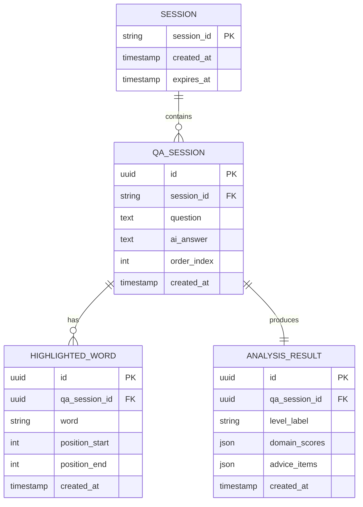

# データモデル設計書

## 0. 設計方針

### MVPはDBレスのステートレス設計

要件定義書の非機能要件に「**ユーザーの質問内容は外部に保存しない（MVPフェーズ）**」と明記されている。
また、ユーザーアカウント機能（US-030）はWon'tであり、セッション完結で動作する。

**結論: MVPにデータベースは不要。**
全データはクライアント側の状態管理（React State / sessionStorage）とAPIリクエスト/レスポンスのJSONで完結させる。

将来の拡張（US-020: 履歴保存）に備えてデータ構造の定義は行い、DBスキーマ化の指針を残す。

---

## 1. ER図（将来拡張時の想定）



---

## 2. APIのデータ構造（MVPで実際に使用）

MVPではDBの代わりに、以下のJSONスキーマをAPIリクエスト/レスポンスとして使用する。

### 2-1. 質問送信リクエスト（SCR-001 → API）

```json
{
  "question": "DNSとは何ですか？"
}
```

| フィールド | 型 | 必須 | 説明 |
|-----------|-----|------|------|
| question | string | YES | ユーザーの質問文。最大500文字 |

---

### 2-2. AI回答レスポンス（API → SCR-002）

```json
{
  "answer": "DNS（ドメインネームシステム）は、インターネット上のドメイン名をIPアドレスに変換する仕組みです。"
}
```

| フィールド | 型 | 説明 |
|-----------|-----|------|
| answer | string | AIが生成した回答テキスト |

---

### 2-3. 分析リクエスト（SCR-002 → API）

```json
{
  "question": "DNSとは何ですか？",
  "answer": "DNS（ドメインネームシステム）は...",
  "highlighted_words": [
    { "word": "IPアドレス", "position_start": 28, "position_end": 37 },
    { "word": "ネームサーバー", "position_start": 65, "position_end": 72 }
  ]
}
```

| フィールド | 型 | 必須 | 説明 |
|-----------|-----|------|------|
| question | string | YES | 元の質問文 |
| answer | string | YES | AIの回答文 |
| highlighted_words | array | YES | ハイライトされた単語リスト（空配列も可） |
| highlighted_words[].word | string | YES | ハイライトした単語・フレーズ |
| highlighted_words[].position_start | int | NO | 回答文中の開始位置（任意） |
| highlighted_words[].position_end | int | NO | 回答文中の終了位置（任意） |

---

### 2-4. 分析結果レスポンス（API → SCR-003）

```json
{
  "level_label": "ITインフラ 入門段階",
  "domain_scores": [
    { "domain": "ネットワーク", "score": 2, "max_score": 5, "label": "初級" },
    { "domain": "セキュリティ", "score": 0, "max_score": 5, "label": "未入門" },
    { "domain": "開発・プログラミング", "score": 3, "max_score": 5, "label": "中級" }
  ],
  "highlighted_words": ["IPアドレス", "ネームサーバー"],
  "advice_items": [
    {
      "priority": "high",
      "topic": "IPアドレスとサブネットの基礎",
      "comment": "「ネットワーク入門」から始めよう"
    },
    {
      "priority": "medium",
      "topic": "DNSの仕組み（ネームサーバー）",
      "comment": "IPアドレスを理解した後に取り組む"
    }
  ]
}
```

| フィールド | 型 | 説明 |
|-----------|-----|------|
| level_label | string | AIが判定した全体的な習熟度ラベル |
| domain_scores | array | IT領域ごとのスコア |
| domain_scores[].domain | string | 領域名（ネットワーク・セキュリティ・開発等） |
| domain_scores[].score | int | スコア（0〜max_score） |
| domain_scores[].max_score | int | 最大スコア（固定値: 5） |
| domain_scores[].label | string | スコアのラベル（未入門/初級/中級/上級/熟練） |
| highlighted_words | array | ハイライトされた単語の文字列リスト |
| advice_items | array | 学習アドバイスのリスト（優先度順） |
| advice_items[].priority | string | "high" / "medium" / "low" |
| advice_items[].topic | string | 学習トピック名 |
| advice_items[].comment | string | 一言アドバイス |

---

## 3. クライアント側の状態管理スキーマ

Reactのstateとして保持するデータ構造。

```typescript
type AppState = {
  // SCR-001 → SCR-002 に引き継ぐ
  question: string;
  answer: string;

  // SCR-002 で操作
  highlightedWords: HighlightedWord[];

  // SCR-003 で表示
  analysisResult: AnalysisResult | null;
};

type HighlightedWord = {
  word: string;
  positionStart?: number;
  positionEnd?: number;
};

type AnalysisResult = {
  levelLabel: string;
  domainScores: DomainScore[];
  highlightedWords: string[];
  adviceItems: AdviceItem[];
};

type DomainScore = {
  domain: string;
  score: number;
  maxScore: number;
  label: string;
};

type AdviceItem = {
  priority: "high" | "medium" | "low";
  topic: string;
  comment: string;
};
```

---

## 4. 設計判断の記録

| 判断事項 | 選択 | 理由 | 代替案 |
|----------|------|------|--------|
| DB有無 | **DBなし（MVPはステートレス）** | 要件に「質問内容は外部に保存しない」と明記。セッション完結で十分 | PostgreSQL / SQLite |
| 状態保持場所 | **クライアントState（React）** | セッション中のみ有効で良い。シンプルに保てる | sessionStorage, Redux |
| 主キー戦略（将来拡張時） | UUID v4 | 将来のユーザー追加・分散環境でも衝突しない | AUTO INCREMENT |
| ハイライト位置情報 | **任意（position_start/end はNO）** | MVP段階では単語文字列のみで分析可能。UI表示に位置情報は不要 | 必須化して厳密管理 |
| domain_scores の領域定義 | **AIが動的に判断** | 固定のマスタテーブルより柔軟。質問内容に応じた領域を返せる | マスタテーブルで管理 |
| advice_items の件数 | **APIレスポンスに委ねる（目安2〜5件）** | AIの判断に任せる方が質問内容に適応できる | 固定3件 |

---

## 5. 将来拡張時のマイグレーション順序

US-020（履歴保存）を実装する際の順序。

1. `sessions`（依存なし）
2. `qa_sessions`（sessions に依存）
3. `highlighted_words`（qa_sessions に依存）
4. `analysis_results`（qa_sessions に依存）

---

## 6. シードデータ方針

**MVPフェーズはシードデータ不要**（DBなし）。

将来拡張時：
- `sessions` テーブルに開発用テストセッションを1件投入
- `qa_sessions` に代表的な質問パターン（DNS、HTTP、Git等）を複数件投入
- E2Eテストのフィクスチャとして管理
